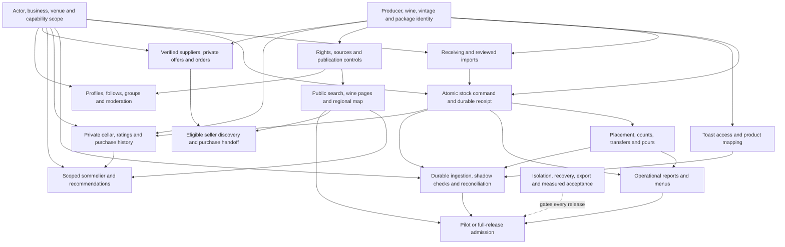

# Rebuild dependency map

September 5, 2026. This is a navigation map of the **proposed target**, not proof that these capabilities are implemented. It preserves all 68 outcomes and their original phases. The existing [seven-landing execution graph](../2026-09-05-terroir-rebuild/dependency-graph.mmd) remains the proposed reduced-pilot schedule; neither that scope nor a new deadline is activated here.

## What exists today

The [current architecture](../../ARCHITECTURE.md) describes a Next.js modular monolith with domain services and Supabase transactions. CSV onboarding still uses both import sessions **and** child batches; sessions do not replace batch operations. Invoice extraction remains a separate scanning workflow. Pours use `record_pour`; legacy end-of-shift reconciliation uses `reconcile_open_bottles_batch`. The newer accept/undo queue uses compensating application writes and is not one atomic transaction. Retaining those boundaries is deliberate until a replacement workflow proves equivalent behavior.

The package contains 19 runtime and 25 development dependencies; all have runtime, build, script, config or type consumers. The cleanup leaves versions, lockfile, API routes, authorization, migrations and database types unchanged.

## Target dependencies

Arrows show required information or contracts. Parallel exploration and interface drafting can start earlier; stock-writing consumers wait for reviewed ownership and ledger contracts. This diagram does not authorize database changes.

The solid paths into admission illustrate full-release requirements; pilot admission uses only its explicitly selected scope plus all applicable isolation/recovery gates. The diagram is not the complete acceptance checklist: community, suppliers, recommendations and later outcomes retain their own phases and entry criteria. Purchase handoff does not imply a merchant checkout. Merchant checkout remains excluded (E-063); outbound Toast availability remains deferred (E-064). Public facts must not join private inventory or costs. Recommendations retrieve private context only through authorized tools and should preserve producer, region, regional vintage conditions and sensory-profile evidence separately.

| Contract or data owner | First consumer | Why it must be settled early |
|---|---|---|
| Actor / group / operating business / venue / capabilities | Invited scoped catalog read | Central oversight must not leak another business's stock, costs or terms. |
| Producer / wine / vintage state / package / source lineage | Approved-product lookup and receiving | Every scan, seller offer and recommendation must refer to the same identity without forcing uncertain matches. |
| Exact quantity / lot / custody / atomic command / durable receipt | Manual receiving and correction | Retries and concurrent actions must neither lose nor double-count stock. |
| Count observation / draft envelope / consumption reconciliation | Counts, offline drafts, pours and Toast | Freeze shared interfaces before separate teams implement conflicting stock effects. |
| Source assertion / publication rights / withdrawal | Search, knowledge pages, regional map | Private facts and unlicensed source material cannot become public catalog truth. |
| Durable inbox / lease / dedupe / terminal exception | Toast shadow comparison | Provider redelivery, corrections and manual overlap must be replayable before automatic deductions. |
| Preference events / ratings / provenance / permissioned retrieval | Sommelier and wine comparison | A purchase, repeat purchase and tasting rating are different signals; no unsupported sensory or vintage claims. |

[Outcome-to-area index](outcome-areas.csv) covers every ID once. It intentionally does not copy approval or delivery status; read those from the original [scope matrix](../2026-09-05-terroir-rebuild/scope.csv). Public source rights, pilot partner access, recovery proof and measured builder capacity are external prerequisites that adding coding agents cannot remove.

## Five highest-impact next actions

1. **Set one release contract.** Reconcile the complete-release ambition with the reviewed 14-day NO-GO. Select measurable pilot scope or extend the full-release schedule; keep the 68-outcome target visible. This prevents agents building against incompatible definitions of done.
2. **Start the Toast and pilot access track immediately.** Confirm authorized restaurant access, representative menus, mappings, receiving examples and review windows with the pilot operators. Run shadow comparison before stock deductions. This work can proceed alongside engineering once access is authorized and avoids late integration surprises.
3. **Prove the isolated candidate foundation.** Identify its account/project/region, block legacy routes and credentials, and demonstrate restore and two-business/two-venue isolation with synthetic fixtures. Then freeze the minimal ownership, identity and stock contracts with one schema owner.
4. **Deliver one complete receiving workflow.** Invited scoped lookup → reviewed manual receipt → atomic ledger → visible cellar balance → correction/export. Test retries, foreign/revoked actors and persistence through restart. Use the result to measure throughput and qualify the coding lanes before adding parallel builders.
5. **Turn verified workflows into pilot and investor evidence.** Record real acceptance results, failures and operator feedback against the exact deployed SHA. Add placement/counts/transfers and Toast consumers in dependency order; public discovery and sommelier work can use reviewed identity/publication contracts in parallel. Re-estimate from measured work instead of increasing the feature promise.
