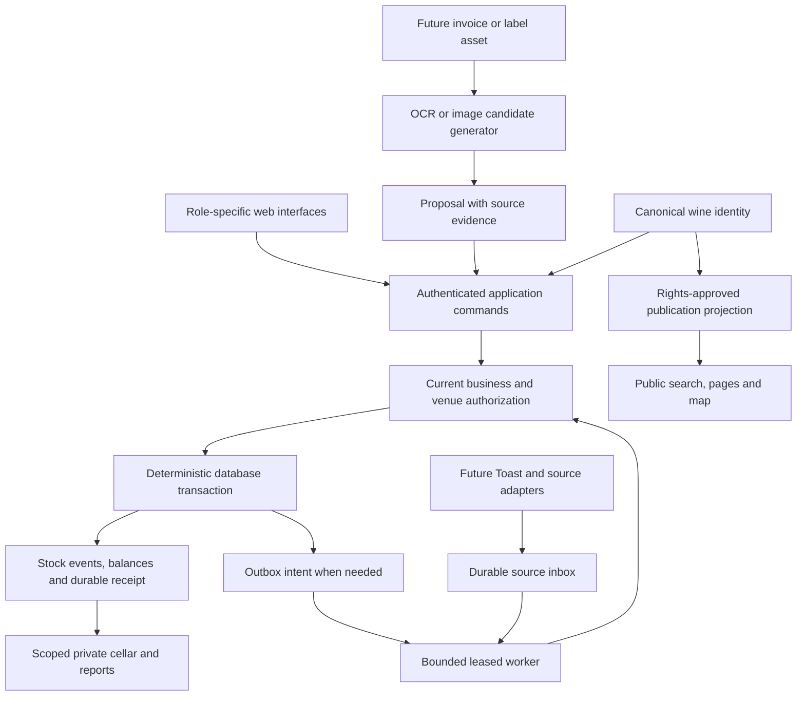

# Terroir architecture research addendum

**Research date:** September 5, 2026, Los Angeles. **Status:** recommendations for the existing planning package. Gate 1 remains unapproved; this document changes no feature commitment, estimate, dependency or runtime.

**Recommendation: retain the modular Next.js/Supabase application and strengthen its inventory, evidence and permission boundaries.** The research adds useful implementation candidates and acceptance cases. It provides no evidence that Terroir needs microservices, a different database or a complete platform replacement.

Your attachment contains 18 infrastructure repositories. I also recovered six previously referenced wine products: Vivino, Delectable, Vinous, InVintory, Bevly and Bevrly. Bevly is the liquor-store POS product; Bevrly is the restaurant inventory product. They are separate research subjects.

**How to read the evidence.** “Published” describes what an official source documents, including vendor claims that we have not runtime-tested. “Historical” marks dated or potentially stale material. Recommendations are our interpretation, not evidence of a competitor's internal implementation. The public material does not establish the current private backend architecture of these six applications.

**What the wine applications teach us**

| Application | Published evidence and its limits | Adopt or adapt for Terroir | Reject or improve |
|---|---|---|---|
| **Vivino** | Its scanner guide documents bottle, wine-list and multiple-label capture. An undated PTC case study describes Vuforia Cloud Recognition; its current role is unknown. [Scanner guide](https://www.vivino.com/en/wine-news/vivino-wine-scanner), [historical architecture case study](https://www.ptc.com/en/case-studies/vivino) | Keep a provider-neutral capture record with original asset, mode, candidates, source evidence and provider/run version. Resolve its result to Terroir's canonical wine identity. | Improve recoverability: a changed recognition provider must not erase earlier evidence or change stock identity silently. Do not choose Vuforia from historical adoption alone. |
| **Delectable** | Its official guide describes submitting multiple images and correcting an incorrect match. It does not publish the queue design or an identification SLA. [Official guide](https://delectable.com/feeds/10_tips_delectable) | Give each image an independent status within a resumable batch. An ambiguous bottle can await review while other items finish. | Keep a visible correction path and bounded retries. Do not infer human staffing, recognition technology or backend topology from the upload flow. |
| **Vinous** | A 2015 release distinguishes reviews, tasting notes and scores. Former API/subscription URLs did not yield a current developer contract in this run. This is historical content evidence. [Dated release](https://v1.vinous.com/articles/press-release-vinous-announces-launch-of-revolutionary-wine-app-dec-2015) | Separate wine identity from licensed commentary, attributed producer claims and private house notes. Entitlement belongs to the content source. | Require a current commercial/API contract before a connector. Preserve attribution and withdrawal; avoid copied critic text and unexplained score blending. |
| **InVintory** | The Partner API advertises bottle-movement webhooks, scoped API keys and roles. Its help centre defines storage, section and slot. Neither source proves delivery guarantees or tenant enforcement. [Partner API](https://invintory.com/api/), [location model](https://help.invintory.com/en/articles/9945386-common-vinlocate-terms) | Explicit movements and human-readable locations fit Terroir. Extend the physical hierarchy beneath the owning business and venue. | A cellar visualization reads committed stock; it cannot become a competing stock authority. Permit unplaced stock and lots without requiring a 3D slot for every bottle. |
| **Bevly** | Its audit page describes logged counts, adjustments and variances, plus zone-based counts. These are vendor-described behaviors. [Audit page](https://bevlypos.com/pos-solutions/audits-shrink-control/) | Freeze an expected-stock cutoff for each count, then record observations and adjudicated variances. Preserve actor, area and source transactions. | Account for movements during counting; never overwrite a current balance with an older count. Retail UPC, loyalty and POS assumptions do not automatically fit restaurants. |
| **Bevrly** | Its inventory guide stages counts for manager confirmation and describes inventory-cycle boundaries. Database, worker and transaction semantics remain private. [Cycle guide](https://bevrly.com/docs/inventory/cycle-overview) | Distinguish a proposal from an authorized committed change. Make pending, confirmed and corrected states understandable to staff. | Keep continuous movement history across reporting periods. A refund or counting-cycle close must not silently imply physical wine returned to stock. |

These products support a shared catalog with separate role-specific experiences. Restaurant staff should see receiving and exceptions; collectors should see their cellar and tasting history; consumers should see discovery and observed seller offers. A producer or distributor manages its own attributed portfolio and commercial information. That is a Terroir design proposal based on the agreed personas, not a claim that a competitor implements this model.

**The 18 supplied repositories**

All entries received a fit assessment. Deeper reading covered seven projects and eight architecture pages; the remaining rows are technology-fit triage, not source-code audits. “Reject” below means reject the dependency for the current rebuild, not dismiss the project.

| Repository | Decision | Transferable lesson or reason |
|---|---|---|
| [Kubernetes](https://github.com/kubernetes/kubernetes) | Adopt pattern | Compare desired and observed state when rebuilding projections or supervising durable jobs. Keep Railway as the proposed runtime. |
| [etcd](https://github.com/etcd-io/etcd) | Adopt pattern | Verify snapshot integrity and rebuild or invalidate dependent caches after restoration. Keep managed Postgres as storage. |
| [Envoy](https://github.com/envoyproxy/envoy) | Adopt pattern | Bound retry concurrency, attempts and age so a provider outage does not create a retry storm. |
| [Netflix Eureka](https://github.com/Netflix/eureka) | Reject dependency | The proposed modular application has no service-discovery requirement. |
| [Uber Cadence](https://github.com/cadence-workflow/cadence) | Adopt pattern; defer engine | Persist workflow progress and isolate repeatable external activities. Consider an engine only when measured workflow complexity justifies it. |
| [Vitess](https://github.com/vitessio/vitess) | Reject dependency | MySQL sharding does not fit the current Supabase/Postgres design. |
| [CockroachDB](https://github.com/cockroachdb/cockroach) | Adopt pattern | Preserve atomic business transactions and explicit contention handling. No distributed-database requirement has been established. |
| [Ceph](https://github.com/ceph/ceph) | Reject dependency | A self-operated storage cluster would add a second storage operating model without an identified need. |
| [SeaweedFS](https://github.com/seaweedfs/seaweedfs) | Reject dependency | No measured file-distribution bottleneck justifies replacing managed object storage. |
| [Mcrouter](https://github.com/facebook/mcrouter) | Reject dependency | Terroir has no established Memcached-fleet routing problem. |
| [Linux](https://github.com/torvalds/linux) | Study only | Useful systems material; the application consumes a host kernel. |
| [FreeBSD](https://github.com/freebsd/freebsd-src) | Study only | OS architecture is outside the current application decision. |
| [gVisor](https://github.com/google/gvisor) | Evaluate only if the threat model changes | Relevant to executing untrusted workloads. It cannot substitute for tenant authorization or data isolation. |
| [xv6](https://github.com/mit-pdos/xv6-riscv) | Study only | Educational operating-system code has no direct runtime role here. |
| [Backstage](https://github.com/backstage/backstage) | Adopt pattern | Keep module owner, lifecycle and source metadata near code. A separate developer portal is unnecessary at this stage. |
| [Terraform GKE module](https://github.com/terraform-google-modules/terraform-google-kubernetes-engine) | Defer | Reconsider only with an approved, evidence-backed move to GKE. |
| [Prometheus](https://github.com/prometheus/prometheus) | Evaluate later | Define useful metrics now; choose collection and storage only after workload, retention and cost requirements. |
| [Grafana](https://github.com/grafana/grafana) | Evaluate later | Useful dashboard candidate once a telemetry backend is selected. Self-hosting and code licensing need a separate adoption decision. |

The strongest source-backed lessons are resource-specific [controller loops](https://kubernetes.io/docs/concepts/architecture/controller/), [retry budgets](https://www.envoyproxy.io/docs/envoy/latest/api-v3/config/cluster/v3/circuit_breaker.proto.html), [durable workflows](https://cadenceworkflow.io/docs/concepts/workflow-engine) with [fallible activities](https://cadenceworkflow.io/docs/concepts/activities), [transaction atomicity](https://www.cockroachlabs.com/docs/stable/developer-basics.html), [software ownership metadata](https://backstage.io/docs/features/software-catalog/) and [restore verification](https://etcd.io/docs/v3.7/op-guide/recovery/).

A critical adaptation: a controller loop must not collapse Toast's sale, correction and refund history into a latest-status field. Retain provider events or snapshots with source identity/version, then calculate and post each allowed change through the stock transaction boundary. A refund alone does not establish physical restocking. Also, receiving checks current grants; it does not grant the receiving user new authority.

**More directly useful GitHub candidates**

| Candidate | Published capability | Proposed Terroir use | Adoption boundary |
|---|---|---|---|
| [InvenTree](https://github.com/inventree/InvenTree) | Separates a part from physical stock items, quantities and locations; receiving carries purchase-order cost to stock. [Stock model](https://docs.inventree.org/en/stable/stock/), [receiving](https://docs.inventree.org/en/stable/purchasing/purchase_order/) | Study canonical wine/package versus business-owned receipt lots and custody locations. Preserve cost provenance. | Adapt domain distinctions. Do not replace Terroir with the application. Current repository code license: [MIT](https://github.com/inventree/InvenTree/blob/master/LICENSE). |
| [ERPNext](https://github.com/frappe/erpnext) | Retains original postings and records reversals when transactions are cancelled. Current documentation also allows controlled valuation reposting in some cases. [Ledger documentation](https://docs.frappe.io/erpnext/immutable-ledger-in-erpnext) | Strengthen correction and reversal cases in the existing stock design. | Adopt the idea, not accounting/ERP code or a new platform. Current repository code license: [GPL-3.0](https://github.com/frappe/erpnext/blob/develop/license.txt). |
| [Medusa](https://github.com/medusajs/medusa) | Inventory levels distinguish stocked, reserved and incoming quantities; incoming quantities do not determine current availability. [Inventory concepts](https://docs.medusajs.com/resources/commerce-modules/inventory/concepts) | Keep owned stock, reservations and expected deliveries distinct when purchasing, transfers and allocation enter scope. | Domain reference only. [Current license](https://github.com/medusajs/medusa/blob/develop/LICENSE) is MIT with explicit Enterprise Edition exclusions. No merchant checkout is added. |
| [Graphile Worker](https://github.com/graphile/worker) and [pg-boss](https://github.com/timgit/pg-boss) | PostgreSQL-backed job processing; Graphile documents at-least-once execution, and pg-boss documents transactional job creation. [Graphile behavior](https://worker.graphile.org/docs), [pg-boss contract](https://github.com/timgit/pg-boss) | Compare these with the planned Postgres inbox/outbox before writing a larger custom worker. Graphile is a promising fit for SQL-authored jobs; pg-boss is an alternative to test. | Choose at most one after transaction, connection, migration, shutdown/recovery and deployment checks. Both advertise MIT licensing. Neither removes business-level idempotency. No new queue dependency in S. |
| [MapLibre GL JS](https://github.com/maplibre/maplibre-gl-js) + [PostGIS](https://supabase.com/docs/guides/database/extensions/postgis) | Browser vector-map renderer plus geographic queries within Postgres. | Candidate for public region/producer discovery and seller location views. | Full-release evaluation. MapLibre identifies BSD-3-Clause licensing; preserve its bundled notices. Tile, geocoder, boundary and imagery rights/costs remain separate. Never project private cellar locations into public maps. |
| [OpenTelemetry JS](https://github.com/open-telemetry/opentelemetry-js) | Instrumentation for traces, metrics and logs; OpenTelemetry does not itself supply the storage/viewing backend. [Official explanation](https://opentelemetry.io/docs/what-is-opentelemetry/) | Carry one safe operation identifier from request through transaction and later worker attempts. Evaluate SDK integration against current observability before adding it. | Apache-2.0 code. Define redaction, retention and backend cost. Do not infer that installing the SDK supplies an operations dashboard. |

For search, test existing PostgreSQL capabilities before adding a search service: [full-text search](https://supabase.com/docs/guides/database/full-text-search) and [trigram similarity](https://www.postgresql.org/docs/current/pgtrgm.html) can support text matching. This is a fit recommendation, not measured relevance or latency. Keep approved-product lookup inside S; public and fuzzy identity-review experiences retain their existing later admission gates. Tenant filters apply before private candidates leave the server, including counts and suggestions.

Before adopting any dependency, record its exact version or commit, applicable license files, runtime/database compatibility, upgrade owner and a passing representative test. Repository popularity and recent commits alone do not establish suitability.

**Hugging Face and document/vision candidates**

| Candidate | Evidence and possible use | Recommendation |
|---|---|---|
| [Granite Docling 258M](https://huggingface.co/ibm-granite/granite-docling-258M) with [Docling](https://github.com/docling-project/docling) | Structured document parsing candidate. The model repository lists Apache-2.0 for the model; Docling code is MIT. Training-data rights were not audited. The card warns about inaccurate outputs. | Evaluate on authorized wine invoices against manual entry and a second parser. No inference or machine-memory benchmark was run here. |
| [PaddleOCR](https://github.com/PaddlePaddle/PaddleOCR) | Current repository points to PaddleOCR-VL-1.6 (0.9B), with document/scene OCR options. Code: Apache-2.0; training-data rights remain unknown. | Evaluate as the invoice challenger. The harvested older 1.5 model card does not establish the 1.6 weights license; resolve that before selecting or downloading weights. |
| [DINOv2-small](https://huggingface.co/facebook/dinov2-small) | Image feature extractor; standard [DINOv2 code and weights](https://github.com/facebookresearch/dinov2) use Apache-2.0. | Test as a bottle-label candidate generator over authorized reference images. It cannot establish wine/vintage identity or stock changes. No wine-specific accuracy is proven by its model card. |
| [WineSensed](https://huggingface.co/datasets/Dakhoo/L2T-NeurIPS-2023) | Card reports Vivino-origin content and CC BY-NC-ND 4.0. A 2025 update adds wine names, changing the earlier “no names” description. | Preserve VWP-FR-011's substantive restriction: no product index or training ingestion. Names and provider IDs do not prove a canonical Terroir join. Hard-negative/domain-gap evaluation only after rights review; otherwise use authorized partner photos. |
| [X-Wines](https://github.com/rogerioxavier/X-Wines) | Dataset/schema reference; the publisher labels the dataset CC0-1.0. A separate code license was not established. | Study fields and normalization. This research authorizes no additional ingestion and does not clear upstream assets or ratings. It proves no recognition accuracy. |

Use the same reviewed inputs for each evaluation. For invoices, measure missing/extra lines, field accuracy, arithmetic consistency, abstention and reviewer correction time. For bottle lookup, freeze the reference index and a separate holdout containing similar labels, different vintages and bottles absent from the index. Measure ranking, false acceptance and abstention. Report cold/warm latency and total memory pressure on the shared 16 GiB Mac. Freeze acceptance thresholds before running; vendor benchmarks do not establish Terroir performance.

**How these lessons fit together**

The following is a proposed full-target flow. Later capabilities remain later; this diagram is not a Day-14 scope expansion.

A stock command binds its operation key to the payload. Authorization, validation, inventory effect, audit event and durable result commit together. Where asynchronous work is needed, persist its intent in that same transaction. A worker may retry after a crash; the database returns the prior committed result for the same operation and rejects conflicting reuse. External side effects need their own provider-aware recovery protocol. Job-delivery marketing cannot prove exactly-once effects across systems.

Public knowledge uses reviewed assertions and assets with rights, attribution and withdrawal lineage. Private stock, supplier terms, costs and notes stay behind their own permission boundary. A shared wine ID joins concepts; it does not authorize sharing the records attached to it. An account-specific distributor quote is different from an observed public seller offer, and neither guarantees current stock or delivery eligibility.

Model output remains a proposal with page/region or reference-image evidence. Human review supplies a command; deterministic validation and current authorization decide whether that command can commit. A model never becomes the stock writer or the authority for canonical identity, public ratings or private permissions.

**Proposed effects on the existing plan**

These are refinements to review within already specified contracts. Any additional implementation or test effort needs estimation before admission. No rows or phases were changed in the 68-outcome matrix.

| Existing requirement / landing | Clarification from research | Scope boundary |
|---|---|---|
| E-002/E-003; V1 and M1 | Owning business, custody venue and authority remain separate. Receive does not create grants; revoked access fails at execution. | Existing S boundary. No group-administration expansion. |
| E-005/E-012/E-013; M2 and V2 | Separate catalog identity from physical receipt lots. Verify repeated receipt, conflicting key reuse, correction and traceable stock/cost provenance. | Existing manual S workflow only; no purchase orders, scanning, imports or bin editor. |
| E-031/E-032; V3 and V4 | Restore checks include objects and dependent projections; exports preserve source IDs and correction lineage without exposing unauthorized costs. | Existing recovery/export scope; no new infrastructure deployment. |
| E-008/E-011; later intake slices | Capture batch, per-artifact status, evidence-bearing proposals and review are distinct resources. | OCR, labels and imports remain deferred from S. |
| E-009/E-010/E-014/E-015/E-016/E-017; later operations | Distinguish expected deliveries, custody transfers, counts, reservations and physical consumption. Count cutoffs account for subsequent events. | Full-release workflows; no speculative S schema for all future cases. |
| E-020–E-023; later Toast slice | Durable input, source version, bounded retry, idempotent effect and operator exception handling. Replay tests must include corrected and out-of-order inputs. | Real provider access and shadow validation still required. No claim that a generic queue proves Toast readiness. |
| E-024–E-027/E-046–E-054; later public/supplier slices | Publish only permitted assertions; account-specific terms and public seller observations use separate views and freshness rules. | Public search/map and supplier participation retain their existing phases. Merchant checkout stays excluded. |

Implement complete user outcomes after scope approval. For example, later automated receiving should land as upload → extraction evidence → correction → committed receipt → cellar result, including failure recovery. A parser endpoint or queue deployment alone is not that slice. Likewise, public discovery needs working search, linked knowledge, map behavior and withdrawal tests; a map widget alone does not meet that outcome.

**Verified corrections and remaining uncertainty**

The synthesis tightens three research suggestions: stock receipt checks grants rather than changing them; desired-state reconciliation does not erase provider history; and third-party recognition remains replaceable. It also corrects the Medusa blanket-MIT assumption, the inference that old Paddle weights license a newer model, and the outdated WineSensed claim that its card contains no wine names. WineSensed's rights and canonical-join restrictions remain intact.

Current private competitor stacks, vendor integration contracts, wine-specific model quality and Terroir performance/cost savings remain unverified. Temporal was not separately compared in this round; any future workflow-engine selection would require that comparison. No quantified speedup or new infrastructure price is claimed. Further research is justified when it resolves an admitted slice's decision, such as a queue compatibility test or an authorized invoice evaluation; it should not postpone the existing scope decision indefinitely.

**Review and provenance**

Three independent research lanes covered competitors, infrastructure and Hugging Face while the primary agent researched inventory systems, Postgres workers, search, geography and telemetry. Official pages, repository metadata and license files supplied the evidence. Subscription Gemini discovery was attempted; search timeouts used built-in web search as fallback. Local crawl4ai handled page harvesting, with official direct/web fallback where needed. No Firecrawl credits, model weights or paid inference were used.

The new addendum has its own independent GPT-5.6 Sol evidence and architecture review. See the [independent review](evidence/architecture-research/verification.md) for the verdict and resolved findings, the [38 quoted evidence anchors](evidence/architecture-research/claims.jsonl), and the [mechanical checks](evidence/architecture-research/checks.json). The prior plan's Fable/Opus reviews do not certify this new research; no new Fable/Opus agreement is claimed. The previous Fable final reread hit its subscription limit. Research sources and recommendations are not implementation acceptance.

Canonical application baseline was rechecked at `abdc661abde43b0ac70a81f740b61d21da7e414b`; the existing planning directory remains the only untracked repository path. No application code, migrations, branches, settings, model installs or deployments changed. This addendum leaves the previous full-release deadline verdict and the proposed smaller evaluation scope intact.
